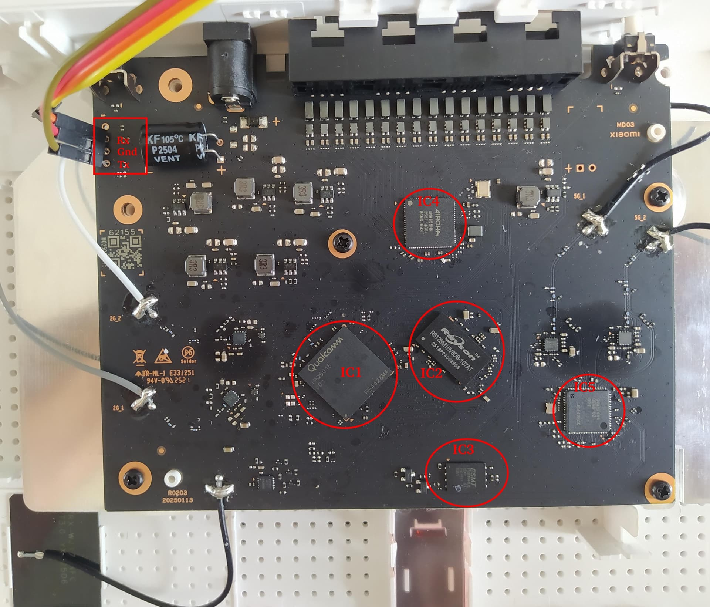

# OpenWrt for the Xiaomi Mi Router AX3000T (RD03v2)

Pure, mainline-based **OpenWrt** for the **Xiaomi AX3000T**, hardware revision **RD03v2** (Qualcomm IPQ5018). Replaces Xiaomi's locked "MiWiFi/XiaoQiang" stock firmware with software you fully control — installed **permanently to NAND**, booting on its own with no serial cable after the first flash.

**Status — everything works:**

| Component | Status |
|---|---|
| SoC bring-up (IPQ5018, kernel 6.12) | ✅ |
| Boots from NAND, unattended, persistent config | ✅ |
| Airoha **AN8855** 2.5 GbE switch (4× LAN) | ✅ |
| Wired LAN data path | ✅ |
| WiFi **2.4 GHz** (IPQ5018) | ✅ |
| WiFi **5 GHz** (QCN6122) | ✅ |
| Front status LED (blue/amber) | ✅ |
| Updates via `sysupgrade` (from the RAM-booted initramfs — see below) | ✅ |

> Built against **OpenWrt `25ee126`** (Jul 2026 snapshot, kernel 6.12.94).

---

## ⚠️ Read this first

- **This is for the `RD03v2` hardware revision only** (IPQ5018 + AN8855 switch + QCN6122 5 GHz). Check the sticker/board. Other AX3000T revisions (e.g. the MT7981 "RD23" variant) are **completely different hardware** — this will brick them.
- **You need a USB↔UART (3.3 V) serial adapter** and to solder/attach to the board's UART pads for the *initial* install. After OpenWrt is on NAND, updates need no serial.
- **There is real brick risk.** Flashing NAND on a locked-bootloader device can go wrong. Every step here is recoverable via the stock TFTP recovery (below), but **do this at your own risk.** We are not responsible for bricked routers.
- The stock console is **read-only** and the bootloader ignores keypresses by default — this guide shows how to get around that.

---

## Credits

This port stands on the shoulders of prior work:

- **[csharper2005](https://github.com/csharper2005/openwrt)** — the **Airoha AN8855 DSA switch driver**, the base device tree, and the `qca-nss-dp` phy-less-2500 fix. Without this, the 2.5 GbE switch (the hard part of this SoC) wouldn't work. The DTS and driver here are their work.
- **[thmalmeida](https://forum.openwrt.org/t/adding-support-for-xiaomi-ax3000t-rd03v2/235136/28)** and the OpenWrt-forum thread **[“Adding support for Xiaomi AX3000T (RD03v2)”](https://forum.openwrt.org/t/adding-support-for-xiaomi-ax3000t-rd03v2/235136)** — the community reverse-engineering effort: board teardown, the annotated UART/chip photo used in this README, and much of the early legwork on this hardware revision.
- **[Ziyang Huang (hzyitc)](https://github.com/hzyitc)** — the **ath11k “smallbuffers” low-memory support** ([OpenWrt PR #21495](https://github.com/openwrt/openwrt/pull/21495)), which halves ath11k's RAM footprint and is what lets both radios run comfortably on this 256 MB board. Carried here as a patch under `files/` with authorship preserved.
- **[OpenWrt](https://openwrt.org/)** — the `qualcommax/ipq50xx` target and everything underneath.

**What this repo adds on top** (the pieces that were missing to make it a *usable, installable* router):
1. **NAND install + boot integration** — wiring the device into `platform.sh` so `sysupgrade` actually writes to flash *and* sets the U-Boot boot-flags that make the stock bootloader boot OpenWrt instead of stock.
2. **The WiFi fix** — the ath11k firmware↔board-data version match that stops the Q6 co-processor crashing (both radios).
3. Per-board caldata extraction, the 2.4 GHz radio enablement, and this end-to-end install guide.

The goal is to feed this **upstream to OpenWrt**. If you can help clean it up for a PR, please do.

---

## Quick start (flash the prebuilt image)

Prebuilt images are on the [Releases](../../releases) page:

| File | Purpose |
|---|---|
| `…-initramfs-uImage.itb` | Boots OpenWrt entirely in RAM. **Required for every flash** — you run `sysupgrade` from this RAM system; it never touches flash by itself |
| `…-squashfs-sysupgrade.bin` | The permanent image, written to NAND by `sysupgrade` **run from the RAM initramfs above** (not in place — see the warning in step 4) |
| `…-squashfs-factory.ubi` | Whole-UBI image. **Not used by this guide** — the stock bootloader is locked (no OEM web-flash / no unlocked U-Boot write), so there is no supported way to write it directly. Install via the initramfs + `sysupgrade` path instead |

The install is a **UART + TFTP** procedure because the stock bootloader is locked. Full walkthrough below.

---

## Installation guide

### Board layout & UART



*Annotated board photo courtesy of **thmalmeida** ([OpenWrt forum](https://forum.openwrt.org/t/adding-support-for-xiaomi-ax3000t-rd03v2/235136/28)).*

**UART header** (top-left, red box) — 3 pads, top→bottom: **Rx · Gnd · Tx**, **115200 8N1, 3.3 V**. The labels are the board's pins, so cross them to your adapter: board **Rx → adapter TX**, board **Tx → adapter RX**, **Gnd → Gnd** (leave the adapter's VCC unconnected). If you get no output or garbage, swap Rx/Tx.

**Main ICs:**

| | Chip | Role |
|---|---|---|
| IC1 | Qualcomm **IPQ5018** | SoC — dual Cortex-A53, integrated 2.4 GHz radio |
| IC2 | Rayson **RS128M16V0DB** | 256 MB DDR3 SDRAM |
| IC3 | **ESMT F50D1G41LB** | 128 MB SPI-NAND flash |
| IC4 | Airoha **AN8855** | 2.5 GbE DSA switch (the 4 LAN/WAN ports) |
| IC5 | Qualcomm **QCN6122** | 5 GHz WiFi radio (by the 5G antenna pads) |

### 0. What you need
- The router, an RD03v2.
- A **3.3 V USB-UART adapter** wired to the board UART (see the photo above): **board Rx↔adapter TX, board Tx↔adapter RX, GND↔GND** (leave VCC unconnected), **115200 8N1**.
- A Linux PC with an Ethernet port, `dnsmasq` (or any TFTP server), and a serial terminal (`screen`, `picocom`, …).
- The **stock `recovery.bin`** for the RD03v2 (a full stock image — used to re-enable the bootloader console). *We don't redistribute Xiaomi firmware; obtain the matching stock image for your unit.*
- The three OpenWrt images from Releases.

### 1. Serial + TFTP setup
Connect UART. On the PC, put your wired NIC on `192.168.31.100/24` and run a TFTP/DHCP server serving a directory that contains `recovery.bin` and the OpenWrt `…initramfs-uImage.itb` (renamed e.g. `owrt.itb`). Example with dnsmasq:

```bash
sudo ip addr add 192.168.31.100/24 dev eth0
sudo dnsmasq --interface=eth0 --bind-dynamic --no-daemon \
  --dhcp-range=192.168.31.20,192.168.31.200,5m \
  --dhcp-boot=recovery.bin,,192.168.31.100 --dhcp-option=66,192.168.31.100 \
  --enable-tftp --tftp-root=/path/to/tftp --tftp-no-blocksize --port=0
```
Open the serial console: `screen /dev/ttyUSB0 115200`.

### 2. Re-enable the bootloader console (TFTP recovery)
The stock U-Boot ignores keypresses (`boot_wait=off`). A stock **TFTP recovery** turns it back on:
1. Power off the router.
2. Hold the **reset** button and, while holding, plug power in. Keep holding ~8–10 s until the LED **blinks**, then release.
3. It DHCPs, pulls `recovery.bin`, verifies + reflashes stock (~2–3 min on the console), and halts. This sets `boot_wait=on`.

> ⚠️ **Do the `saveenv` of step 3 on the very next boot — before stock ever
> boots to userspace.** The recovery's `boot_wait=on` is not persistent: the
> stock firmware's first full boot silently turns `boot_wait` **off** again,
> the countdown drops to zero, and no amount of keypressing will reach the
> prompt — you'd have to redo this recovery. (The recovery halts after
> flashing precisely so you get that first boot; use it.)

### 3. Boot OpenWrt in RAM
Power-cycle (no reset). Now the bootloader pauses. **Interrupt it** (spam Enter as it boots) to reach the `IPQ5018#` prompt, then:
```
setenv boot_wait on
setenv bootdelay 5
saveenv
setenv ipaddr 192.168.31.1
setenv serverip 192.168.31.100
tftpboot 0x44000000 owrt.itb
bootm 0x44000000
```
The `tftpboot` is **slow — expect ~100 KB/s, so ~2–3 minutes for the ~14 MB
image**. U-Boot's TFTP is 512-byte stop-and-wait blocks through a polling
ethernet driver; the crawling `#` marks are progress, not a stall (a gigabit
link doesn't help). Give it time before assuming failure.

OpenWrt boots from RAM. Nothing has been written to flash yet — if anything looks wrong, just power-cycle back to stock.

### 4. Flash to NAND

> **This RAM-initramfs step is mandatory for every flash — the first install *and* every later update.** It is the only path that yields a bootable image: running `sysupgrade` from the RAM system triggers `xiaomi_initramfs_prepare`, which `ubiformat`s **both** UBI partitions and writes a kernel UBI the locked stock bootloader can actually attach. A plain **in-place** `sysupgrade` from the *installed* NAND system skips that wipe and leaves a UBI that Linux can read but the stock bootloader **cannot** attach (`UBI init error 22`) — an unbootable loop. (`platform.sh` now refuses an in-place `sysupgrade` on this board and points you here.)

On the RAM OpenWrt (root shell on serial, or SSH to `192.168.1.1` once you bring up the LAN), copy the `…squashfs-sysupgrade.bin` onto the device (scp/wget over the LAN), then:
```sh
sysupgrade -n /tmp/openwrt-…-squashfs-sysupgrade.bin
```
Our `platform.sh` case wipes the UBI, writes kernel+rootfs, **and sets the U-Boot boot-flags** (`flag_try_sys{1,2}_failed=8`, etc.) so the stock bootloader boots our slot. It reboots into OpenWrt **from NAND**. Done — the serial cable is no longer required for normal use.

> ⚠️ **Run `sysupgrade` where it cannot be interrupted** — from the serial console, or a persistent SSH session on the RAM system. **Never wrap it in `timeout`** (or any droppable/killable wrapper): a NAND write torn mid-flight corrupts the kernel UBI and bricks the device the same way (`UBI init error 22`).

**To update later:** repeat steps 3–4 — TFTP-boot the new `…-initramfs-uImage.itb` into RAM, then `sysupgrade` from it. Do **not** `sysupgrade` in place from the running system.

**A single `UBI init error 22` on the first boot after a correct flash is
expected and harmless.** The loader's first attach of the fresh UBI fails once,
the A/B logic bumps `flag_try_sys1_failed` and resets, and the second attempt
attaches cleanly — every boot after that is error-free (and `rc.local` then
pins the boot-success flags). Don't re-flash over it.

**If you hit a `UBI init error 22` boot *loop*** (the error on *every* boot — in-place/interrupted flash): it is recoverable, not a hard brick. Repeat steps 3–4 (RAM-boot the initramfs via TFTP, then `sysupgrade -n`); the initramfs path `ubiformat`s and self-heals the corrupt UBI. Worst case, redo the stock TFTP recovery (step 2) and start over.

### 5. First boot
- LAN is `192.168.1.1`. Ports `lan2/lan3/lan4` bridge into `br-lan`; the `wan` port is the AN8855's WAN.
- **Set a root password** (`passwd`) and configure WiFi (LuCI or `uci`). By default the WiFi vifs are created **disabled** — enable them with `uci set wireless.default_radio{0,1}.disabled=0; uci commit wireless; wifi`.

### Recovering / going back to stock
Repeat the **TFTP recovery** (step 2) with the stock `recovery.bin` — it reflashes stock over everything.

---

## Building from source

```bash
git clone <this repo> && cd openwrt-xiaomi-ax3000t-rd03v2
./build.sh          # clones OpenWrt @ 25ee126, applies files/, builds
NSS=1 ./build.sh    # ...plus experimental QCA NSS hardware offload (~900 Mbps)
```
Or manually: check out OpenWrt at `25ee126`, copy `files/*` over it, `./scripts/feeds update -a && ./scripts/feeds install -a`, seed `.config` with the device + `CONFIG_TARGET_ROOTFS_INITRAMFS=y`, then `make defconfig && make -j$(nproc)`. Images land in `bin/targets/qualcommax/ipq50xx/`.

**NSS hardware offload** (`NSS=1`, opt-in) boots the IPQ5018's NSS network
processor to offload NAT routing at line rate, instead of the CPU-bound
~380 Mbps of software offload. It's experimental and layers heavy QCA feeds/
patches on top of mainline — see [`docs/nss-offload.md`](docs/nss-offload.md).

See [`MANIFEST.txt`](MANIFEST.txt) for every file and what it does.

---

## How it works (the interesting bits)

**The 2.5 G switch.** The AN8855 hangs off GMAC1 over a 2.5 G SerDes link with no PHY — which made `qca-nss-dp` abort probe (`swphy: unknown speed`). csharper2005's driver + nss-dp patch fix the phy-less 2500 CPU port; the switch then comes up as a normal DSA switch (`lan2/lan3/lan4/wan`).

**Making the locked bootloader boot OpenWrt.** Xiaomi's U-Boot boots by an A/B "try/fail" flag scheme and loads the kernel from a specific UBI volume. A naive `sysupgrade` fails (`Can't open device for writing`) and even a successful write wouldn't boot (the bootloader keeps loading the stock kernel). The fix is the `platform.sh` case for our board: it sets `CI_KERN_UBIPART`/`CI_ROOT_UBIPART`, and writes `fw_setenv` boot-flags (`flag_try_sys{1,2}_failed=8`, `flag_boot_rootfs=0`, `uart_en=1`, `boot_wait=on`) that force the bootloader onto our slot — mirroring the proven `xiaomi_ax6000`/`redmi-ax5400` path.

**The WiFi crash.** With correct board data the Q6 firmware still crashed: `phyrf_bdf.c … ANTENNACHAIN_AXIS_Z … zero`. The board data wasn't wrong — it was a **version mismatch**: OpenWrt ships ath11k firmware `WLAN.HK.2.7.0.1`, but the stock board-data (`bdwlan`) is built for `2.5.r4`. Downgrading the firmware to 2.5 fails too (too old for the 6.12 driver → `err_smem_ver`). The fix keeps the 2.7 firmware and uses **2.7-compatible board data**: for 2.4 GHz, the `board-id 255` entry from ath11k-firmware's own `IPQ5018/hw1.0/board-2.bin` (which is byte-identical to its `board-id 0x24` entry — i.e. the AX3000T's own board data, just in 2.7 format); for 5 GHz, a working QCN6122 device's 2.7 board data. Per-unit calibration still comes from the board's own `0:ART` partition at runtime.

**Memory (256 MB, and the smallbuffers fix).** After the SoC reserves ~76 MB for the WiFi co-processor and bootloader, Linux sees ~180 MB — and by default the two ath11k radios hold ~85–90 MB of *unswappable* kernel memory (DMA ring buffers + firmware host memory). That left only ~15 MB free, and under load the kernel OOM-killer would shoot `hostapd`/`netifd`, dropping WiFi. The fix is **`kmod-ath11k-smallbuffers`** — Ziyang Huang's [PR #21495](https://github.com/openwrt/openwrt/pull/21495), which shrinks ath11k's DP ring buffers (TX-completion 32768→2048, RX-DMA 4096→1024, monitor rings 4096→128), mirroring the long-standing `ath10k-smallbuffers`. It cuts the ath11k footprint from ~85 MB to **~38 MB**, leaving **~66–100 MB free** — normal-router headroom. Tested: a 70 MB memory-pressure spike (far beyond any real load) produces **zero OOM kills** with both radios up — on real RAM alone, no swap needed. Trade-off: smaller buffers mean a little less headroom at extreme throughput, and monitor-mode capture is degraded — both irrelevant for an AP, and the accepted trade-off for low-RAM devices.

---

## Known limitations

- **5 GHz board data is a compatible stand-in** (from another QCN6122 device) re-keyed for our board, not the AX3000T's own 2.7 board data (which doesn't exist upstream). 5 GHz works; antenna/TX-power tuning may be imperfect. If you can produce a proper 2.7 QCN6122 BDF for this board, please contribute it.
- **Front LED is driven as plain GPIO**, not PWM (blue on GPIO12, amber on GPIO13). Stock firmware fades it via the IPQ5018 PWM block (`pwm2`/`pwm3`), but kernel 6.12's `pinctrl-ipq5018` can't yet mux those functions onto GPIO 12/13 — so the LED works (status/failsafe/upgrade triggers) but is on/off only, no hardware fade. A pinctrl patch adding the `pwm` groups would restore PWM.
- This is a snapshot build; treat as beta.

## Contributing / upstreaming

PRs welcome — especially help getting this **upstream into OpenWrt** and improving the 5 GHz board data. The AN8855 driver is separately on its way to mainline via csharper2005 and the Airoha/MediaTek DSA work.

## License

Follows OpenWrt's licensing (GPL-2.0 / device files as in-tree). The AN8855 driver and DTS retain their original authors' licenses and copyright.
