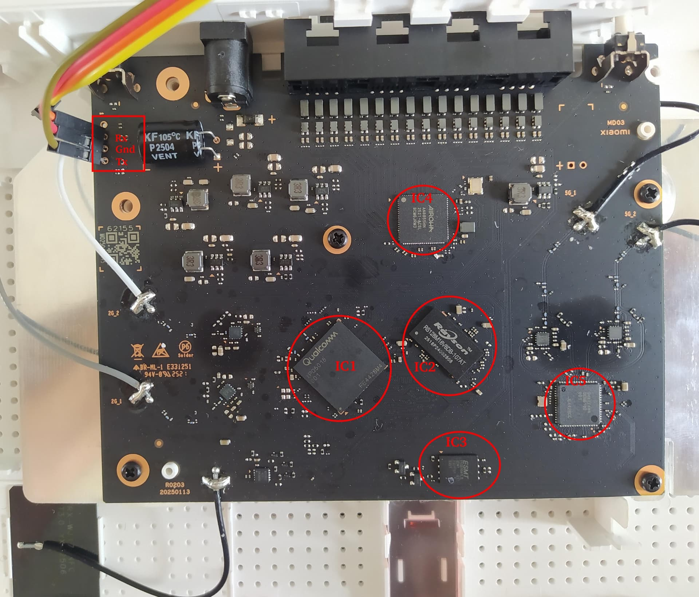

# OpenWrt for the Xiaomi Mi Router AX3000T (RD03v2)

Pure, mainline-based **OpenWrt** for the **Xiaomi AX3000T**, hardware revision **RD03v2** (Qualcomm IPQ5018). Replaces Xiaomi's locked "MiWiFi/XiaoQiang" stock firmware with software you fully control — installed **permanently to NAND**, booting on its own with no serial cable after the first flash.

**Status — everything works:**

| Component | Status |
|---|---|
| SoC bring-up (IPQ5018, kernel 6.12) | ✅ |
| Boots from NAND, unattended, persistent config | ✅ |
| Airoha **AN8855** 2.5 GbE switch (4× LAN) | ✅ |
| Wired LAN data path | ✅ |
| WiFi **2.4 GHz** (IPQ5018) | ✅ |
| WiFi **5 GHz** (QCN6122) | ✅ |
| Front status LED (blue/amber, 0–255 soft-PWM fade + patterns) | ✅ |
| **LuCI** web interface (plain HTTP via uhttpd) | ✅ |
| Updates via `sysupgrade` (from the RAM-booted initramfs — see below) | ✅ |

> Built against **OpenWrt `25ee126`** (Jul 2026 snapshot, kernel 6.12.94).

---

## ⚠️ Read this first

- **This is for the `RD03v2` hardware revision only** (IPQ5018 + AN8855 switch + QCN6122 5 GHz). Check the sticker/board. Other AX3000T revisions (e.g. the MT7981 "RD23" variant) are **completely different hardware** — this will brick them.
- **Check your stock ROM version first, and keep the router off the internet until you have flashed.** This install needs a stock `recovery.bin` **at least as new as the version your unit last ran** — the bootloader enforces anti-rollback ([step 2](#2-re-enable-the-bootloader-console-tftp-recovery)). Only 2.0.12 is easy to find publicly, so a unit left to OTA-update past it can be shut out of this guide entirely ([#12](https://github.com/ADCDS/openwrt-xiaomi-ax3000t-rd03v2/issues/12)). The stock web UI shows the ROM version.
- **You need a USB↔UART (3.3 V) serial adapter** and to solder/attach to the board's UART pads for the *initial* install. After OpenWrt is on NAND, updates need no serial.
- **There is real brick risk.** Flashing NAND on a locked-bootloader device can go wrong. Every step here is recoverable — once you are past step 3 the U-Boot prompt stays available (the install persists `boot_wait=on`/`uart_en=1`), and the stock TFTP recovery is the backstop underneath it, **provided you hold a `recovery.bin` new enough to be accepted** (below). But **do this at your own risk.** We are not responsible for bricked routers.
- The stock console is **read-only** and the bootloader ignores keypresses by default — this guide shows how to get around that.

---

## Credits

This port stands on the shoulders of prior work:

- **[csharper2005](https://github.com/csharper2005/openwrt)** — the **Airoha AN8855 DSA switch driver**, the base device tree, and the `qca-nss-dp` phy-less-2500 fix. Without this, the 2.5 GbE switch (the hard part of this SoC) wouldn't work. The DTS and driver here are their work.
- **[thmalmeida](https://forum.openwrt.org/t/adding-support-for-xiaomi-ax3000t-rd03v2/235136/28)** and the OpenWrt-forum thread **[“Adding support for Xiaomi AX3000T (RD03v2)”](https://forum.openwrt.org/t/adding-support-for-xiaomi-ax3000t-rd03v2/235136)** — the community reverse-engineering effort: board teardown, the annotated UART/chip photo used in this README, and much of the early legwork on this hardware revision.
- **[Ziyang Huang (hzyitc)](https://github.com/hzyitc)** — the **ath11k “smallbuffers” low-memory support** ([OpenWrt PR #21495](https://github.com/openwrt/openwrt/pull/21495)), which halves ath11k's RAM footprint and is what lets both radios run comfortably on this 256 MB board. Carried here as a patch under `files/` with authorship preserved.
- **[OpenWrt](https://openwrt.org/)** — the `qualcommax/ipq50xx` target and everything underneath.

**What this repo adds on top** (the pieces that were missing to make it a *usable, installable* router):
1. **NAND install + boot integration** — wiring the device into `platform.sh` so `sysupgrade` actually writes to flash *and* sets the U-Boot boot-flags that make the stock bootloader boot OpenWrt instead of stock.
2. **The WiFi fix** — the ath11k firmware↔board-data version match that stops the Q6 co-processor crashing (both radios).
3. Per-board caldata extraction, the 2.4 GHz radio enablement, and this end-to-end install guide.

The goal is to feed this **upstream to OpenWrt**. If you can help clean it up for a PR, please do.

---

## Quick start (flash the prebuilt image)

Prebuilt images are on the [Releases](../../releases) page:

| File | Purpose |
|---|---|
| `…-initramfs-uImage.itb` | Boots OpenWrt entirely in RAM. **Required for every flash** — you run `sysupgrade` from this RAM system; it never touches flash by itself |
| `…-squashfs-sysupgrade.bin` | The permanent image, written to NAND by `sysupgrade` **run from the RAM initramfs above** (not in place — see the warning in step 4) |
| `…-squashfs-factory.ubi` | Whole-UBI image. **Not used by this guide** — the stock bootloader is locked (no OEM web-flash / no unlocked U-Boot write), so there is no supported way to write it directly. Install via the initramfs + `sysupgrade` path instead |
| `…-initramfs-factory.ubi` | The RAM image wrapped as a UBI volume. Only for the **no-UART** path — written into `ubi_kernel` from a running system to pivot into the initramfs without serial ([`docs/no-uart-reflash.md`](docs/no-uart-reflash.md)) |
| `…-initramfs-uImage-wifi.itb`<br>`…-initramfs-factory-wifi.ubi` | The same two RAM images, but this build's initramfs brings **both radios up** while it runs from RAM, so the flash needs no LAN cable |
| `…-kmods.tar.gz` | Every kernel module built against **this exact image**, as installable `.apk`s. See [Installing kernel modules](#installing-kernel-modules) |
| `nand-support.txt` | The SPI-NAND parts this release's kernel can drive, keyed by the `flash_type` byte the stock bootloader records. Machine-readable; check it if your unit does not boot |

Each file also comes in an `-nss` variant (`…-sysupgrade-nss.bin`), built with the experimental
QCA NSS hardware offload — see [`docs/nss-offload.md`](docs/nss-offload.md). The two are not
interchangeable: the NSS kernel differs, so its kmod tarball only matches its own image.
The four initramfs artifacts are `…-initramfs-uImage{,-nss}{,-wifi}.itb` and likewise for
`-initramfs-factory…ubi`; the kmod tarball for a flavour matches **both** of its initramfs
variants, because they come from one build and differ only in `/etc/rc.local`.

**The `-wifi` installer.** Use it when you have no cable to spare. It comes up beaconing
`OpenWrt-RD03v2-Installer` (WPA2, key `rd03v2install`) on both bands, bridged into `br-lan`; join
it, `ssh root@192.168.1.1`, and run step 4 from there. Both the SSID and the key are published, so
this is not a secret — but the exposure is the flash itself, a few minutes on a box whose root
account has no password either way, and it ends at the reboot into NAND. The beacon is gated on
the rootfs being `tmpfs`, i.e. it only happens while running from RAM: the permanent image you
flash from it is an ordinary `…-squashfs-sysupgrade.bin` and still comes up with the radios off,
whichever installer wrote it.

**`nand-support.txt`.** This board's SPI-NAND is second-sourced, and a kernel that does not know
the part does not come up at all (see the `unknown raw ID` row under
[Quick troubleshooting](#quick-troubleshooting)). The stock bootloader probes the chip and leaves
its device byte in the U-Boot environment, so a unit will tell you which one it has:

```sh
fw_printenv flash_type    # from OpenWrt   -> e.g. "flash_type=be"
nvram get flash_type      # from stock
```

Look that byte up in the first column of `nand-support.txt`. `11` is the common ESMT
F50D1G41LB; `be` is the Winbond W25N01KWZEIG, which **no release before v1.7 could probe**.

The install is a **UART + TFTP** procedure because the stock bootloader is locked. Full walkthrough below.

---

## Installation guide

### Board layout & UART



*Annotated board photo courtesy of **thmalmeida** ([OpenWrt forum](https://forum.openwrt.org/t/adding-support-for-xiaomi-ax3000t-rd03v2/235136/28)).*

**UART header** (top-left, red box) — 3 pads, top→bottom: **Rx · Gnd · Tx**, **115200 8N1, 3.3 V**. The labels are the board's pins, so cross them to your adapter: board **Rx → adapter TX**, board **Tx → adapter RX**, **Gnd → Gnd** (leave the adapter's VCC unconnected). If you get no output or garbage, swap Rx/Tx.

**Main ICs:**

| | Chip | Role |
|---|---|---|
| IC1 | Qualcomm **IPQ5018** | SoC — dual Cortex-A53, integrated 2.4 GHz radio |
| IC2 | Rayson **RS128M16V0DB** | 256 MB DDR3 SDRAM |
| IC3 | **ESMT F50D1G41LB** *or* **Winbond W25N01KW** | 128 MB SPI-NAND flash — the part is second-sourced, both are supported |
| IC4 | Airoha **AN8855** | 2.5 GbE DSA switch (the 4 LAN/WAN ports) |
| IC5 | Qualcomm **QCN6122** | 5 GHz WiFi radio (by the 5G antenna pads) |

### 0. What you need
- The router, an RD03v2.
- A **3.3 V USB-UART adapter** wired to the board UART (see the photo above): **board Rx↔adapter TX, board Tx↔adapter RX, GND↔GND** (leave VCC unconnected), **115200 8N1**.
- A Linux PC with an Ethernet port, `dnsmasq` (or any TFTP server), and a serial terminal (`screen`, `picocom`, …).
- The **stock `recovery.bin`** for the RD03v2 — a full stock image, used to re-enable the bootloader console. It must be built for **RD03v2** *and* be **no older than the stock version your unit last ran** (anti-rollback — see step 2). *We don't redistribute Xiaomi firmware; obtain a matching stock image for your unit.*
- The three OpenWrt images from Releases.

### 1. Serial + TFTP setup
Connect UART. On the PC, put your wired NIC on `192.168.31.100/24` and run a TFTP/DHCP server serving a directory that contains `recovery.bin` and the OpenWrt `…initramfs-uImage.itb` (renamed e.g. `owrt.itb`). Example with dnsmasq:

```bash
sudo ip addr add 192.168.31.100/24 dev eth0
sudo dnsmasq --interface=eth0 --bind-dynamic --no-daemon \
  --dhcp-range=192.168.31.20,192.168.31.200,5m \
  --dhcp-boot=recovery.bin,,192.168.31.100 --dhcp-option=66,192.168.31.100 \
  --enable-tftp --tftp-root=/path/to/tftp --tftp-no-blocksize --port=0
```
Open the serial console: `screen /dev/ttyUSB0 115200`.

### 2. Re-enable the bootloader console (TFTP recovery)
The stock U-Boot ignores keypresses (`boot_wait=off`). A stock **TFTP recovery** turns it back on:
1. Power off the router.
2. Hold the **reset** button and, while holding, plug power in. Keep holding ~8–10 s until the LED **blinks**, then release.
3. It DHCPs, pulls `recovery.bin`, verifies it (**signature *and* version** — see below), reflashes stock (~2–3 min on the console), and halts. This sets `boot_wait=on`.

> ⚠️ **Anti-rollback — the one hard prerequisite of this whole guide.** The
> bootloader refuses any `recovery.bin` older than the stock version the unit
> last ran. It compares integer version codes (`0x20000 + patch` on the 2.0.x
> line: 2.0.12 → 131084, 2.0.28 → 131100) and rejects the image on the console:
>
> ```
> [miwifi] upgrade_miwifirom = 131084
> [miwifi] not permit upgrade!
> ========Upgrade fail!========
> ```
>
> Equal versions are accepted; only *older* is refused. The check runs **before
> anything is written**, so a rejected image leaves the unit exactly as it was —
> but you cannot get to step 3 without a new-enough one. Editing the version out
> of an older image does not work either: the bootloader RSA-2048-verifies it.

> ⚠️ **Do the `saveenv` of step 3 on the very next boot — before stock ever
> boots to userspace.** The recovery's `boot_wait=on` is not persistent: the
> stock firmware's first full boot silently turns `boot_wait` **off** again,
> the countdown drops to zero, and no amount of keypressing will reach the
> prompt — you'd have to redo this recovery. (The recovery halts after
> flashing precisely so you get that first boot; use it.)

#### If anti-rollback blocks you

The recovery exists in this guide for exactly one reason: to set `boot_wait=on`
(and `uart_en=1`) so you can reach the U-Boot prompt in step 3. Anything that
sets those two variables replaces it. Options, best first:

1. **Obtain a newer stock image.** Any version code ≥ your installed one works.
   The router's own `check_rom_update` API returns no download URL once it is
   already on the newest release, so in practice this means a mirror.
2. **Root on stock**, then set `boot_wait=on` / `uart_en=1` from userspace and
   go straight to step 3. Be warned that on **2.0.28 every published route to
   root is closed** — the Lua API validators, xmir-patcher's exploits, native
   `mkxqimage`, and the backup/restore path have all been re-tested and all
   fail, and the UART is read-only in boot mode so there is no console to
   escape into. Older stock builds may still be reachable.
3. **External SPI-NAND programmer** on the flash chip (ESMT F50D1G41LB or
   Winbond W25N01KW) — version- and
   Xiaomi-independent, and the only route left on a fully-updated unit. The
   U-Boot environment is a plain MTD partition (`0:APPSBLENV`, offset
   `0x480000`, length `0x80000`); setting the two variables there is enough.
   There is no secure boot on the kernel, so a modified NAND image does boot.
   Most effort and most risk of the three.

### 3. Boot OpenWrt in RAM
Power-cycle (no reset). Now the bootloader pauses. **Interrupt it** (spam Enter as it boots) to reach the `IPQ5018#` prompt, then:
```
setenv boot_wait on
setenv bootdelay 5
saveenv
setenv ipaddr 192.168.31.1
setenv serverip 192.168.31.100
tftpboot 0x44000000 owrt.itb
bootm 0x44000000
```
The `tftpboot` is **slow — expect ~100 KB/s, so ~2–3 minutes for the ~14 MB
image**. U-Boot's TFTP is 512-byte stop-and-wait blocks through a polling
ethernet driver; the crawling `#` marks are progress, not a stall (a gigabit
link doesn't help). Give it time before assuming failure.

OpenWrt boots from RAM. Nothing has been written to flash yet — if anything looks wrong, just power-cycle back to stock.

### 4. Flash to NAND

> **This RAM-initramfs step is mandatory for every flash — the first install *and* every later update.** It is the only path that yields a bootable image: running `sysupgrade` from the RAM system triggers `xiaomi_initramfs_prepare`, which `ubiformat`s **both** UBI partitions and writes a kernel UBI the locked stock bootloader can actually attach. A plain **in-place** `sysupgrade` from the *installed* NAND system skips that wipe and leaves a UBI that Linux can read but the stock bootloader **cannot** attach (`UBI init error 22`) — an unbootable loop. (`platform.sh` now refuses an in-place `sysupgrade` on this board and points you here.)

On the RAM OpenWrt (root shell on serial, or SSH to `192.168.1.1` once you bring up the LAN), copy the `…squashfs-sysupgrade.bin` onto the device (scp/wget over the LAN), then:
```sh
sysupgrade -n /tmp/openwrt-…-squashfs-sysupgrade.bin
```
Our `platform.sh` case wipes the UBI, writes kernel+rootfs, **and sets the U-Boot boot-flags** (`flag_try_sys{1,2}_failed=8`, etc.) so the stock bootloader boots our slot. It reboots into OpenWrt **from NAND**. Done — the serial cable is no longer required for normal use.

> ⚠️ **Run `sysupgrade` where it cannot be interrupted** — from the serial console, or a persistent SSH session on the RAM system. **Never wrap it in `timeout`** (or any droppable/killable wrapper): a NAND write torn mid-flight corrupts the kernel UBI and bricks the device the same way (`UBI init error 22`).

**To update later:** repeat steps 3–4 — TFTP-boot the new `…-initramfs-uImage.itb` into RAM, then `sysupgrade` from it. Do **not** `sysupgrade` in place from the running system. No serial access at hand? The RAM-initramfs pivot can also be done **entirely over SSH** by writing the `…-initramfs-factory.ubi` into the (runtime-unattached) `ubi_kernel` partition and rebooting into it — see [`docs/no-uart-reflash.md`](docs/no-uart-reflash.md).

**A single `UBI init error 22` on the first boot after a correct flash is
expected and harmless.** The loader's first attach of the fresh UBI fails once,
the A/B logic bumps `flag_try_sys1_failed` and resets, and the second attempt
attaches cleanly — every boot after that is error-free (and `rc.local` then
pins the boot-success flags). Don't re-flash over it.

**If you hit a `UBI init error 22` boot *loop*** (the error on *every* boot — in-place/interrupted flash): it is recoverable, not a hard brick. Repeat steps 3–4 (RAM-boot the initramfs via TFTP, then `sysupgrade -n`); the initramfs path `ubiformat`s and self-heals the corrupt UBI. Worst case, redo the stock TFTP recovery (step 2) and start over.

### Quick troubleshooting

| Symptom | Cause → fix |
|---|---|
| Countdown never pauses, no `IPQ5018#` no matter what you press | `boot_wait=off` (stock booted to userspace since the last recovery) → redo the TFTP recovery (step 2), then `saveenv` on the *very next* boot (step 3) |
| `not permit upgrade!` / `Upgrade fail!` during the TFTP recovery | Anti-rollback: your `recovery.bin` is older than the last stock version the unit ran → get an image with a version code ≥ yours, or see [If anti-rollback blocks you](#if-anti-rollback-blocks-you) (step 2) |
| `tftpboot` crawls, endless `#` marks | Normal: U-Boot TFTP is ~100 KB/s → the ~14 MB initramfs takes 2–3 min |
| `spi-nand: unknown raw ID` + `probe … failed with error -95`, empty `/proc/mtd`, `cannot open mtd rootfs`, ath11k `failed to load board data file: -12` | Your unit has a NAND chip the kernel doesn't know — the part is second-sourced. Fixed for the Winbond W25N01KW in **v1.7**; on v1.6 or earlier that unit cannot be flashed at all. Check `fw_printenv flash_type` against the release's `nand-support.txt`; a part listed in neither needs an ID-table entry ([#12](https://github.com/ADCDS/openwrt-xiaomi-ax3000t-rd03v2/issues/12)) |
| **One** `UBI init error 22` on the first boot after flashing | Benign: A/B loader retries and attaches → let it boot |
| `UBI init error 22` on **every** boot | In-place/torn flash → RAM-boot initramfs + `sysupgrade -n` (steps 3–4) |
| NSS build: every port `failed to open conduit`, LAN+WAN dead | NSS fw/driver version mismatch → see [`docs/nss-offload.md`](docs/nss-offload.md) Troubleshooting |

For repeated flashing, [`tools/uboot-catch.sh`](tools/uboot-catch.sh) does step 3's catch + TFTP + boot hands-free — a serial-triggered `reboot` is enough; no reset button, no typing into the 5-second window.

### 5. First boot
- LAN is `192.168.1.1`. Ports `lan2/lan3/lan4` bridge into `br-lan`; the `wan` port is the AN8855's WAN.
- **LuCI** is at `http://192.168.1.1` — plain HTTP, no TLS. There is no password until you set one, so do that first.
- **Set a root password** (`passwd`) and configure WiFi (LuCI or `uci`). By default the WiFi vifs are created **disabled** — enable them with `uci set wireless.default_radio{0,1}.disabled=0; uci commit wireless; wifi`.

  The radios ship disabled deliberately, matching upstream: the default wireless config carries **no encryption**, so a device that came up with radios on would broadcast an open SSID bridged straight into `br-lan` before anyone had set a root password. Set a WPA key at the same time you enable them. For a permanently preconfigured image, bake the config in with `PROFILE=` at build time instead.

### Installing kernel modules

Kernel modules must match the kernel they were built against, and this port builds its own — so
the `kmod-*` packages on `downloads.openwrt.org` will not install here. Every release therefore
ships a `…-kmods.tar.gz` containing every module built against **that release's** image, already
signed with the key that image trusts.

The tarball holds well over a thousand packages, so extract and serve it from your PC rather than
copying the whole thing onto a 256 MB router:

```sh
tar -xzf openwrt-…-v2-kmods.tar.gz -C kmods && cd kmods
python3 -m http.server 8000
```
```sh
# on the router:
apk add --repositories-file /dev/null \
        --repository http://<pc-ip>:8000/packages.adb kmod-usb-storage
```

Three things that will otherwise bite:

- **Point `--repository` at `packages.adb`, not the directory.** Given a bare directory, `apk`
  looks for an Alpine-style `aarch64_cortex-a53/` subdirectory that does not exist here.
- **Install onto the NAND system, not the RAM initramfs.** `apk` refuses a package that would be
  lost on the next reboot, and the initramfs root is tmpfs.
- **Use the tarball matching your exact image** — same release *and* same flavour. The NSS build
  has a different kernel, so its modules are rejected on the default image and vice versa. That is
  the vermagic check doing its job, not a broken download. Cross-release also fails.

`--repositories-file /dev/null` suppresses the built-in OpenWrt snapshot feeds, which are built
from a different commit than this pinned tree.

> **The Software page in LuCI points at those snapshot feeds**, not at this build. Modules
> installed from there are correctly rejected on the vermagic check; userspace packages may
> install but can drag in a mismatched library. Treat remote installs as unsupported and use the
> kmod tarball.

### Controlling the LEDs

The front LED (blue + amber) has full **0–255 brightness and fade/breathing
patterns**, via software PWM (`pwm-gpio` at 200 Hz — the IPQ5018 cannot
hardware-PWM these pins, see Known limitations; steady on/off states cost
nothing). Both colours are standard LED class devices:

```sh
# solid / off / dim
echo none > /sys/class/leds/blue:status/trigger
echo 255  > /sys/class/leds/blue:status/brightness   # full
echo 40   > /sys/class/leds/blue:status/brightness   # dim
# breathing: fade 0 -> 255 -> 0 every 3 s
echo pattern > /sys/class/leds/blue:status/trigger
echo "0 1500 255 1500" > /sys/class/leds/blue:status/pattern
# blink amber on LAN activity
echo netdev  > /sys/class/leds/amber:status/trigger
echo br-lan  > /sys/class/leds/amber:status/device_name
echo "tx rx" > /sys/class/leds/amber:status/mode
```

For a persistent policy use `uci` (`/etc/config/system`):

```
config led
	option name 'lan-activity'
	option sysfs 'amber:status'
	option trigger 'netdev'
	option dev 'br-lan'
	list mode 'tx'
	list mode 'rx'
```

Boot/failsafe/upgrade indications keep working as before (blue =
boot/running, amber = failsafe/upgrade, via the `led-*` DTS aliases).

### Recovering / going back to stock
Repeat the **TFTP recovery** (step 2) with the stock `recovery.bin` — it reflashes stock over everything. The same version rule applies here: the image must be no older than the last stock version the unit ran, so keep a suitable `recovery.bin` alongside your OpenWrt images rather than assuming you can find one later.

---

## Building from source

```bash
git clone <this repo> && cd openwrt-xiaomi-ax3000t-rd03v2
./build.sh            # clones OpenWrt @ 25ee126, applies files/, builds
NSS=1 ./build.sh      # ...plus experimental QCA NSS hardware offload (measured: 895 Mbit/s NAT at ~0% CPU)
KMODS=1 ./build.sh    # ...plus every kernel module as an installable package (slow; used for releases)
```

`KMODS=1` builds ~1100 modules as packages rather than installing them, which is what produces the
release `kmods.tar.gz`. It leaves the image's package set alone but **does change the kernel
vermagic**, so modules only install on an image from the same run — release images are therefore
built with it too. Expect a multi-hour build; without it you get a normal image in normal time.
Or manually: check out OpenWrt at `25ee126`, copy `files/*` over it, `./scripts/feeds update -a && ./scripts/feeds install -a`, seed `.config` with the device + `CONFIG_TARGET_ROOTFS_INITRAMFS=y`, then `make defconfig && make -j$(nproc)`. Images land in `bin/targets/qualcommax/ipq50xx/`.

**NSS hardware offload** (`NSS=1`, opt-in) boots the IPQ5018's NSS network
processor to offload NAT routing at line rate. Measured (LAN→WAN NAT,
gigabit wire; 895/619 on the 2026-07-18 build, 860 re-measured on the
current tree after the delivery-path fix in `999-2758`):

| Path | NAT throughput | Router CPU under load |
|---|---|---|
| CPU slowpath | 619 Mbit/s | 95% sirq (saturated) |
| **NSS offload** | **940 Mbit/s** TCP / **898 Mbit/s** UDP | **~0% sirq, ~95-98% idle** |

Routed frames are delivered ARL-precise (the ECM rule carries the egress
tag_8021q VID — measured 940 Mbit/s TCP at ~99% idle with a 100 Mb/s device
on the LAN); flows the rule cannot tag fall back to a flood path gated by
the slowest LAN port. See "How routed frames actually reach the wire" in
[`docs/nss-offload.md`](docs/nss-offload.md).

(LAN⇄LAN traffic between switch ports is forwarded by the AN8855 fabric at
line rate — ~890 Mbit/s measured — with or without NSS; the offload matters
for *routed* traffic. Verify offload is engaged by watching `top` during
load: near-idle sirq = NSS carrying the flow.) It's experimental and layers
heavy QCA feeds/patches on top of mainline — see
[`docs/nss-offload.md`](docs/nss-offload.md).

See [`MANIFEST.txt`](MANIFEST.txt) for every file and what it does.

---

## How it works (the interesting bits)

**The 2.5 G switch.** The AN8855 hangs off GMAC1 over a 2.5 G SerDes link with no PHY — which made `qca-nss-dp` abort probe (`swphy: unknown speed`). csharper2005's driver + nss-dp patch fix the phy-less 2500 CPU port; the switch then comes up as a normal DSA switch (`lan2/lan3/lan4/wan`).

**Making the locked bootloader boot OpenWrt.** Xiaomi's U-Boot boots by an A/B "try/fail" flag scheme and loads the kernel from a specific UBI volume. A naive `sysupgrade` fails (`Can't open device for writing`) and even a successful write wouldn't boot (the bootloader keeps loading the stock kernel). The fix is the `platform.sh` case for our board: it sets `CI_KERN_UBIPART`/`CI_ROOT_UBIPART`, and writes `fw_setenv` boot-flags (`flag_try_sys{1,2}_failed=8`, `flag_boot_rootfs=0`, `uart_en=1`, `boot_wait=on`) that force the bootloader onto our slot — mirroring the proven `xiaomi_ax6000`/`redmi-ax5400` path.

**The WiFi crash.** With correct board data the Q6 firmware still crashed: `phyrf_bdf.c … ANTENNACHAIN_AXIS_Z … zero`. The board data wasn't wrong — it was a **version mismatch**: OpenWrt ships ath11k firmware `WLAN.HK.2.7.0.1`, but the stock board-data (`bdwlan`) is built for `2.5.r4`. Downgrading the firmware to 2.5 fails too (too old for the 6.12 driver → `err_smem_ver`). The fix keeps the 2.7 firmware and uses **2.7-compatible board data**: for 2.4 GHz, the `board-id 255` entry from ath11k-firmware's own `IPQ5018/hw1.0/board-2.bin` (which is byte-identical to its `board-id 0x24` entry — i.e. the AX3000T's own board data, just in 2.7 format); for 5 GHz, a **native 2.7 QCN6122 board file built from this unit's own stock 2.5 `bdwlan`** lifted into the 2.7 layout (contributed in #6 — earlier releases shipped a re-keyed stand-in from another QCN6122 device). Per-unit calibration still comes from the board's own `0:ART` partition at runtime.

**The "deaf receiver" that wasn't (issue #3, RSSI reporting).** Both radios appeared to *hear* clients ~30 dB too weakly (an in-room client showed −55/−61 dBm where stock read −23), which long looked like a receive-path calibration failure. On-air measurement against an independent receiver proved otherwise: demodulation is perfect (max MCS, zero retries, decodes beacons "below" its own claimed noise floor) — the `WLAN.HK.2.7.0.1` firmware simply **reports** rx signal on an uncalibrated dB scale (~31 dB low on 2.4 GHz, ~24 dB on 5 GHz) and an impossible noise floor (−110/−113 dBm). Stock's 2.5-era firmware reports correctly on the same silicon; no available 2.7-era board file changes it, and the stock board file can't be loaded by 2.7. The fix is host-side, carried as ath11k patch `952`: per-chip signal offsets at every dB→dBm reporting site, plus an implementation of the firmware's dormant `GET_NFCAL_POWER` WMI exchange, whose calibrated per-channel noise floor (−99 dBm on 2.4 GHz, ~−90 on 5 GHz here) replaces the raw survey noise value. After the patch, reported RSSI matches an independent receiver within a couple of dB on both bands, and matches what stock reports for the same client. Cold-boot calibration is unrelated: stock disables it on this board too (three separate gates in the stock scripts), so OpenWrt's `907` patch disabling it costs nothing.

**Bridge VLAN filtering under `tag_8021q` (NSS build).** The NSS build swaps the Airoha special tag for DSA's `tag_8021q` (the NSS datapath cannot parse the 4-byte special tag, so it exceptions every routed frame to the host), which means the CPU link carries a plain 802.1Q header whose VID encodes the source port. That collides head-on with a VLAN-aware bridge, which wants the same VID space and the same per-port PVID register. Up to v1.4 the driver lost that collision badly: the inherited mt7530 `.port_vlan_filtering` forced the **CPU** port to `EG_CONSISTENT` ("untagged in, untagged out"), so the conduit received frames with no VLAN header at all, the tagger had no VID to demux, and the host RX path died for every user port on that CPU port — while TX kept working, so the box stayed visible in the upstream router's FDB while being unreachable. A config revert didn't recover it; only a reboot did. The fix (`999-2762`) follows the mainline sja1105/vsc73xx model: CPU-port egress tagging is owned by `an8855_setup()` alone, and the two writers of the PVID register — `tag_8021q` and the bridge — keep **shadow PVIDs** that a single `commit` function arbitrates on the port's VLAN-awareness. Bridge VLANs in 3072–4095 are now rejected instead of silently corrupting the `tag_8021q` table. See [`docs/an8855-vlan-filtering.md`](docs/an8855-vlan-filtering.md).

**Memory (256 MB, and the smallbuffers fix).** After the SoC reserves ~76 MB for the WiFi co-processor and bootloader, Linux sees ~180 MB — and by default the two ath11k radios hold ~85–90 MB of *unswappable* kernel memory (DMA ring buffers + firmware host memory). That left only ~15 MB free, and under load the kernel OOM-killer would shoot `hostapd`/`netifd`, dropping WiFi. The fix is **`kmod-ath11k-smallbuffers`** — Ziyang Huang's [PR #21495](https://github.com/openwrt/openwrt/pull/21495), which shrinks ath11k's DP ring buffers (TX-completion 32768→2048, RX-DMA 4096→1024, monitor rings 4096→128), mirroring the long-standing `ath10k-smallbuffers`. It cuts the ath11k footprint from ~85 MB to **~38 MB**, leaving **~66–100 MB free** — normal-router headroom. Tested: a 70 MB memory-pressure spike (far beyond any real load) produces **zero OOM kills** with both radios up — on real RAM alone, no swap needed. Trade-off: smaller buffers mean a little less headroom at extreme throughput, and monitor-mode capture is degraded — both irrelevant for an AP, and the accepted trade-off for low-RAM devices.

---

## Known limitations

- **Front LED fade is software-timed** (`pwm-gpio` hrtimer soft-PWM at 200 Hz feeding `pwm-leds` — full 0–255 brightness and `pattern`/breathing triggers, zero cost in steady on/off states). True hardware PWM on these pins is impossible: the IPQ5018 TLMM has no PWM function on GPIO 12/13 (mainline and downstream QSDK pinctrl agree — `pwm2`/`pwm3` only reach GPIO 44/45), so stock's fade was software too.
- **NSS build: no DSA source-port precision under a VLAN-aware bridge.** With `vlan_filtering '1'`, frames reach software carrying the bridge VID rather than a `tag_8021q` VID, so DSA resolves the ingress port imprecisely (`dsa_find_designated_bridge_port_by_vid()`) and the software bridge sorts it out. This is the documented tradeoff for this class of driver in `net/dsa/tag_8021q.c`, not a shortcut here — hardware forwarding between user ports is unaffected. The default (non-NSS) build keeps full precision, because the MTK special tag carries the source port independently of the VLAN table.
- **The buttons need a backported `gpio-button-hotplug` fix** (`files/package/kernel/gpio-button-hotplug/patches/100-*.patch`). `struct gpio_keys_button::irq` is `unsigned int`, so the driver's `if (button->irq < 0) button->irq = 0;` clamp was dead code — harmless while `fwnode_irq_get()` returned 0 for a node with no `interrupts` property, but it now returns `-EINVAL`, which lands in the unsigned field as a huge positive number. The probe then treats it as a firmware-supplied interrupt, skips `gpiod_to_irq()`, drops the trigger flags and requests a nonsense IRQ, so both buttons stay dead (`failed to request irq:0 for gpio:-2`). **OpenWrt fixed this upstream in [`b0a03893cb52`](https://github.com/openwrt/openwrt/commit/b0a03893cb520c64dff89a7b83f6512aab86c15c) (2026-07-10); this port pins `25ee126` (2026-07-06), four days earlier**, so the fix is backported here and should be **dropped once the pin advances** ([#10](https://github.com/ADCDS/openwrt-xiaomi-ax3000t-rd03v2/issues/10)). Note the **mesh** button is `KEY_WPS_BUTTON` (→ `/etc/rc.button/wps`), not a second reset: `gpio-button-hotplug` picks the handler from the key code, not the DT label, so giving both buttons `KEY_RESTART` would make the mesh button factory-reset the router.
- This is a snapshot build; treat as beta.

## Contributing / upstreaming

PRs welcome — especially help getting this **upstream into OpenWrt**. The AN8855 driver is separately on its way to mainline via csharper2005 and the Airoha/MediaTek DSA work.

## License

Follows OpenWrt's licensing (GPL-2.0 / device files as in-tree). The AN8855 driver and DTS retain their original authors' licenses and copyright.
