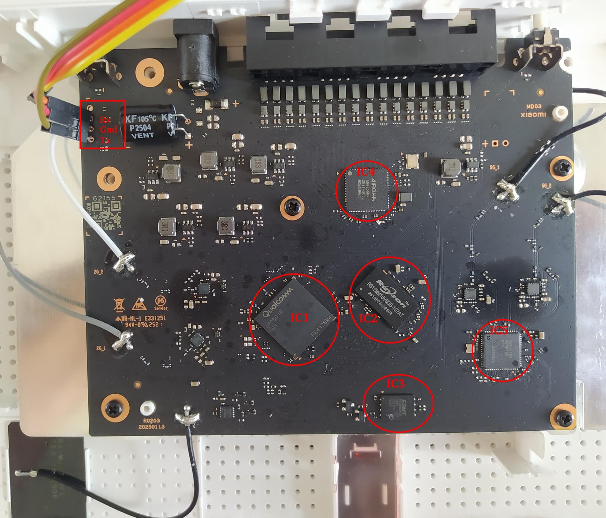

# Release images, UART installation and usage

For the recommended installation without opening the case or using UART, see
[ADCDS/xiaomi-ota-install](https://github.com/ADCDS/xiaomi-ota-install) and use
its hardware-tested `rd03v2` profile. It handles stock root, image validation,
the RAM-initramfs pivot, and the permanent NAND installation.
The procedure below is the alternative UART + TFTP method, followed by usage and recovery notes.

**RD03v2 (Qualcomm IPQ5018) only.** RD03/RD23 MediaTek images and procedures are incompatible.
Flashing can brick the router. For TFTP recovery, keep a stock image at least as new as the last stock version your unit ran.

[Back to README](../README.md)

## Release images

Prebuilt images are on the [Releases](https://github.com/ADCDS/openwrt-xiaomi-ax3000t-rd03v2/releases) page:

| File | Purpose |
|---|---|
| `…-initramfs-uImage.itb` | Boots OpenWrt entirely in RAM. **Required for every flash** — you run `sysupgrade` from this RAM system; it never touches flash by itself |
| `…-squashfs-sysupgrade.bin` | The permanent image, written to NAND by `sysupgrade` **run from the RAM initramfs above** (not in place — see the warning in step 4) |
| `…-squashfs-factory.ubi` | Whole-UBI image. **Not used by this guide** — the stock bootloader is locked (no OEM web-flash / no unlocked U-Boot write), so there is no supported way to write it directly. Install via the initramfs + `sysupgrade` path instead |
| `…-initramfs-factory.ubi` | The RAM image wrapped as a UBI volume. Only for the **no-UART** path — written into `ubi_kernel` from a running system to pivot into the initramfs without serial ([`docs/no-uart-reflash.md`](no-uart-reflash.md)) |
| `…-initramfs-uImage-wifi.itb`<br>`…-initramfs-factory-wifi.ubi` | The same two RAM images, but this build's initramfs brings **both radios up** while it runs from RAM, so the flash needs no LAN cable |
| `…-kmods.tar.gz` | Every kernel module built against **this exact image**, as installable `.apk`s. See [Installing kernel modules](#installing-kernel-modules) |
| `nand-support.txt` | The SPI-NAND parts this release's kernel can drive, keyed by the `flash_type` byte the stock bootloader records. Machine-readable; check it if your unit does not boot |

Each file also comes in an `-nss` variant (`…-sysupgrade-nss.bin`), built with the experimental
QCA NSS hardware offload — see [`docs/nss-offload.md`](nss-offload.md). The two are not
interchangeable: the NSS kernel differs, so its kmod tarball only matches its own image.

As of v1.9 the `-nss` images also carry **NSS Wi-Fi offload**, so ECM can accelerate flows with a
Wi-Fi end instead of only wired ones. Confirmed on hardware: with a 5 GHz client routed through
NAT, `ipv4_create_requests` climbs (0 → 19 in the release test) where earlier `-nss` images left it
at 0 for any load. It is built from a pinned external donor tree and is the newest and
least-exercised part of this port — see
[`docs/nss-wifi-validation.md`](nss-wifi-validation.md) for exactly what was and was not
tested, and note that **no throughput ceiling has been established with offload on**. Offload also
costs ~2.6 MB of the ~6 MB the memory tuning returns, so an `-nss` box nets roughly 3–4 MB. If you
hit Wi-Fi trouble, the plain image contains none of this.

> **`/etc/rc.local` survives every upgrade, so its NSS knobs can go stale.**
> `rc.local` is listed in `/lib/upgrade/keep.d/base-files-essential`, and
> `sysupgrade` saves config by default (`SAVE_CONFIG=1`) — so a **plain
> `sysupgrade <image>`, with no flags at all**, tars your running `rc.local` and
> restores it over the new image's copy in the overlay, where it shadows `/rom`.
> `-f` is not required and `-n` (which discards all config) is the only flag that
> avoids it.
>
> The NSS build puts `general/redirect` and the `ipv{4,6}_accel_mode` writes in
> that file, so upgrading an NSS box — even NSS → NSS — keeps whatever `rc.local`
> you already had. If the new release changed that block, you do not get the
> change, and nothing logs it. After any NSS upgrade:
>
> ```sh
> cmp -s /etc/rc.local /rom/etc/rc.local || cp /rom/etc/rc.local /etc/rc.local
> reboot            # then: cat /proc/sys/dev/nss/general/redirect  -> 1
> ```
>
> This is exactly why v1.9's buffer-pool knobs are **not** in `rc.local` but in
> `/etc/init.d/nss-bufpool`, which is not in any keep list and therefore always
> comes from the image.

The four initramfs artifacts are `…-initramfs-uImage{,-nss}{,-wifi}.itb` and likewise for
`-initramfs-factory…ubi`; the kmod tarball for a flavour matches **both** of its initramfs
variants, because they come from one build and differ only in `/etc/rc.local`.

**The `-wifi` installer.** Use it when you have no cable to spare. It comes up beaconing
`OpenWrt-RD03v2-Installer` (WPA2, key `rd03v2install`) on both bands, bridged into `br-lan`; join
it, `ssh root@192.168.1.1`, and run step 4 from there. Both the SSID and the key are published, so
this is not a secret — but the exposure is the flash itself, a few minutes on a box whose root
account has no password either way, and it ends at the reboot into NAND. The beacon is gated on
the rootfs being `tmpfs`, i.e. it only happens while running from RAM: the permanent image you
flash from it is an ordinary `…-squashfs-sysupgrade.bin` and still comes up with the radios off,
whichever installer wrote it.

**`nand-support.txt`.** This board's SPI-NAND is second-sourced, and a kernel that does not know
the part does not come up at all (see the `unknown raw ID` row under
[Quick troubleshooting](#quick-troubleshooting)). The stock bootloader probes the chip and leaves
its device byte in the U-Boot environment, so a unit will tell you which one it has:

```sh
fw_printenv flash_type    # from OpenWrt   -> e.g. "flash_type=be"
nvram get flash_type      # from stock
```

Look that byte up in the first column of `nand-support.txt`. `11` is the common ESMT
F50D1G41LB; `be` is the Winbond W25N01KWZEIG, which **no release before v1.7 could probe**.

The UART + TFTP alternative is documented below.

## UART installation guide

### Board layout & UART



*Annotated board photo courtesy of **thmalmeida** ([OpenWrt forum](https://forum.openwrt.org/t/adding-support-for-xiaomi-ax3000t-rd03v2/235136/28)).*

**UART header** (top-left, red box) — 3 pads, top→bottom: **Rx · Gnd · Tx**, **115200 8N1, 3.3 V**. The labels are the board's pins, so cross them to your adapter: board **Rx → adapter TX**, board **Tx → adapter RX**, **Gnd → Gnd** (leave the adapter's VCC unconnected). If you get no output or garbage, swap Rx/Tx.

**Main ICs:**

| | Chip | Role |
|---|---|---|
| IC1 | Qualcomm **IPQ5018** | SoC — dual Cortex-A53, integrated 2.4 GHz radio |
| IC2 | Rayson **RS128M16V0DB** | 256 MB DDR3 SDRAM |
| IC3 | **ESMT F50D1G41LB** *or* **Winbond W25N01KW** | 128 MB SPI-NAND flash — the part is second-sourced, both are supported |
| IC4 | Airoha **AN8855** | 2.5 GbE DSA switch (the 4 LAN/WAN ports) |
| IC5 | Qualcomm **QCN6102** | 5 GHz WiFi radio (by the 5G antenna pads); ath11k and its firmware/board files call it QCN6122 |

### 0. What you need
- The router, an RD03v2.
- A **3.3 V USB-UART adapter** wired to the board UART (see the photo above): **board Rx↔adapter TX, board Tx↔adapter RX, GND↔GND** (leave VCC unconnected), **115200 8N1**.
- A Linux PC with an Ethernet port, `dnsmasq` (or any TFTP server), and a serial terminal (`screen`, `picocom`, …).
- The **stock `recovery.bin`** for the RD03v2 — a full stock image, used to re-enable the bootloader console. It must be built for **RD03v2** *and* be **no older than the stock version your unit last ran** (anti-rollback — see step 2). See [Getting a stock `recovery.bin`](#getting-a-stock-recoverybin) for download links and hashes.
- The three OpenWrt images from Releases.

### Getting a stock `recovery.bin`

Both images below are genuine, Xiaomi-signed, and served from Xiaomi's own CDN.
Download either, rename it to `recovery.bin`, and **verify the hash before flashing.**

| Stock version | Version code | Direct download | SHA-256 |
|---|---|---|---|
| **2.0.28** (newest) | 131100 | [`miwifi_rd03v2_firmware_31bf9_2.0.28.bin`](https://cdn.cnbj1.fds.api.mi-img.com/xiaoqiang/rom/rd03v2/miwifi_rd03v2_firmware_31bf9_2.0.28.bin) | `3138342e564c7d7482fde4a90e1778830180f0eac15e1de5f3ad269f9ba9940f` |
| 2.0.12 | 131084 | [`miwifi_rd03v2_firmware_69eec_2.0.12.bin`](https://cdn.cnbj1.fds.api.mi-img.com/xiaoqiang/rom/rd03v2/miwifi_rd03v2_firmware_69eec_2.0.12.bin) | `be7af0e551d440a96757fe885dd775580fd8362addefb594b114f218ccc786c3` |

```bash
sha256sum miwifi_rd03v2_firmware_31bf9_2.0.28.bin
# 3138342e564c7d7482fde4a90e1778830180f0eac15e1de5f3ad269f9ba9940f
```

**Take 2.0.28 unless you have a reason not to.** Anti-rollback refuses only images
*older* than the stock version the unit last ran — equal is accepted — so the newest
image works on every unit, including a fully-updated one.

The same two files are also served by `bigota.miwifi.com` and `cnbj1.fds.api.xiaomi.com`
on the same `xiaoqiang/rom/rd03v2/` path — try those if the link above stops resolving.
Check the hash whichever host you use.

> **Why these were hard to find.** RD03v2 has its **own** CDN ROM directory,
> `xiaoqiang/rom/rd03v2/`, separate from the MediaTek RD03's `xiaoqiang/rom/rd03/`.
> The third-party sites that index Xiaomi firmware never picked up that path, so they
> only ever listed 2.0.11 and 2.0.12 — which is where the belief that nothing newer
> existed came from, and why fully-updated units looked permanently locked out. The
> 2.0.28 image has been on Xiaomi's CDN since 2025-12-25.
>
> If a stock release newer than 2.0.28 appears and your unit has taken it, please open
> an issue — the image is very likely on the CDN under the same path.

### 1. Serial + TFTP setup
Connect UART. On the PC, put your wired NIC on `192.168.31.100/24` and run a TFTP/DHCP server serving a directory that contains `recovery.bin` and the OpenWrt `…initramfs-uImage.itb` (renamed e.g. `owrt.itb`). Example with dnsmasq:

```bash
sudo ip addr add 192.168.31.100/24 dev eth0
sudo dnsmasq --interface=eth0 --bind-dynamic --no-daemon \
  --dhcp-range=192.168.31.20,192.168.31.200,5m \
  --dhcp-boot=recovery.bin,,192.168.31.100 --dhcp-option=66,192.168.31.100 \
  --enable-tftp --tftp-root=/path/to/tftp --tftp-no-blocksize --port=0
```
Open the serial console: `screen /dev/ttyUSB0 115200`.

### 2. Re-enable the bootloader console (TFTP recovery)
The stock U-Boot ignores keypresses (`boot_wait=off`). A stock **TFTP recovery** turns it back on:
1. Power off the router.
2. Hold the **reset** button and, while holding, plug power in. Keep holding ~8–10 s until the LED **blinks**, then release.
3. It DHCPs, pulls `recovery.bin`, verifies it (**signature *and* version** — see below), reflashes stock (~2–3 min on the console), and halts. This sets `boot_wait=on`.

> ⚠️ **Anti-rollback — the one hard prerequisite of this whole guide.** The
> bootloader refuses any `recovery.bin` older than the stock version the unit
> last ran. It compares integer version codes (`0x20000 + patch` on the 2.0.x
> line: 2.0.12 → 131084, 2.0.28 → 131100) and rejects the image on the console:
>
> ```
> [miwifi] upgrade_miwifirom = 131084
> [miwifi] not permit upgrade!
> ========Upgrade fail!========
> ```
>
> Equal versions are accepted; only *older* is refused. The check runs **before
> anything is written**, so a rejected image leaves the unit exactly as it was —
> but you cannot get to step 3 without a new-enough one. Editing the version out
> of an older image does not work either: the bootloader RSA-2048-verifies it.

> ⚠️ **Do the `saveenv` of step 3 on the very next boot — before stock ever
> boots to userspace.** The recovery's `boot_wait=on` is not persistent: the
> stock firmware's first full boot silently turns `boot_wait` **off** again,
> the countdown drops to zero, and no amount of keypressing will reach the
> prompt — you'd have to redo this recovery. (The recovery halts after
> flashing precisely so you get that first boot; use it.)

#### If anti-rollback blocks you

The recovery exists in this guide for exactly one reason: to set `boot_wait=on`
(and `uart_en=1`) so you can reach the U-Boot prompt in step 3. Anything that
sets those two variables replaces it. Options, best first:

1. **Obtain a newer stock image.** Any version code ≥ your installed one works, and
   equal is accepted — so the newest published image (**2.0.28**, code 131100) works
   on any unit up to and including a fully-updated one. Links and hashes are in
   [Getting a stock `recovery.bin`](#getting-a-stock-recoverybin). This is no longer
   a dead end: the router's own `check_rom_update` returns nothing once the unit is
   already on the newest release, but the image is on Xiaomi's CDN regardless.
2. **Use the software installation method.** See
   [xiaomi-ota-install](https://github.com/ADCDS/xiaomi-ota-install), which
   supports the RD03v2 installation without UART.
3. **External SPI-NAND programmer** on the flash chip (ESMT F50D1G41LB or
   Winbond W25N01KW) — version- and
   Xiaomi-independent, and the fallback if no suitable stock image can be obtained
   at all. The
   U-Boot environment is a plain MTD partition (`0:APPSBLENV`, offset
   `0x480000`, length `0x80000`); setting the two variables there is enough.
   There is no secure boot on the kernel, so a modified NAND image does boot.
   Most effort and most risk of the three.

### 3. Boot OpenWrt in RAM
Power-cycle (no reset). Now the bootloader pauses. **Interrupt it** (spam Enter as it boots) to reach the `IPQ5018#` prompt, then:
```
setenv boot_wait on
setenv bootdelay 5
saveenv
setenv ipaddr 192.168.31.1
setenv serverip 192.168.31.100
tftpboot 0x44000000 owrt.itb
bootm 0x44000000
```
The `tftpboot` is **slow — expect ~100 KB/s, so ~2–3 minutes for the ~14 MB
image**. U-Boot's TFTP is 512-byte stop-and-wait blocks through a polling
ethernet driver; the crawling `#` marks are progress, not a stall (a gigabit
link doesn't help). Give it time before assuming failure.

OpenWrt boots from RAM. Nothing has been written to flash yet — if anything looks wrong, just power-cycle back to stock.

### 4. Flash to NAND

> **This RAM-initramfs step is mandatory for every flash — the first install *and* every later update.** It is the only path that yields a bootable image: running `sysupgrade` from the RAM system triggers `xiaomi_initramfs_prepare`, which `ubiformat`s **both** UBI partitions and writes a kernel UBI the locked stock bootloader can actually attach. A plain **in-place** `sysupgrade` from the *installed* NAND system skips that wipe and leaves a UBI that Linux can read but the stock bootloader **cannot** attach (`UBI init error 22`) — an unbootable loop. (`platform.sh` now refuses an in-place `sysupgrade` on this board and points you here.)

On the RAM OpenWrt (root shell on serial, or SSH to `192.168.1.1` once you bring up the LAN), copy the `…squashfs-sysupgrade.bin` onto the device (scp/wget over the LAN), then:
```sh
sysupgrade -n /tmp/openwrt-…-squashfs-sysupgrade.bin
```
Our `platform.sh` case wipes the UBI, writes kernel+rootfs, **and sets the U-Boot boot-flags** (`flag_try_sys{1,2}_failed=8`, etc.) so the stock bootloader boots our slot. It reboots into OpenWrt **from NAND**. Done — the serial cable is no longer required for normal use.

> ⚠️ **Run `sysupgrade` where it cannot be interrupted** — from the serial console, or a persistent SSH session on the RAM system. **Never wrap it in `timeout`** (or any droppable/killable wrapper): a NAND write torn mid-flight corrupts the kernel UBI and bricks the device the same way (`UBI init error 22`).

**To update later:** repeat steps 3–4 — TFTP-boot the new `…-initramfs-uImage.itb` into RAM, then `sysupgrade` from it. Do **not** `sysupgrade` in place from the running system. No serial access at hand? The RAM-initramfs pivot can also be done **entirely over SSH** by writing the `…-initramfs-factory.ubi` into the (runtime-unattached) `ubi_kernel` partition and rebooting into it — see [`docs/no-uart-reflash.md`](no-uart-reflash.md).

**A single `UBI init error 22` on the first boot after a correct flash is
expected and harmless.** The loader's first attach of the fresh UBI fails once,
the A/B logic bumps `flag_try_sys1_failed` and resets, and the second attempt
attaches cleanly — every boot after that is error-free (and `rc.local` then
pins the boot-success flags). Don't re-flash over it.

**If you hit a `UBI init error 22` boot *loop*** (the error on *every* boot — in-place/interrupted flash): it is recoverable, not a hard brick. Repeat steps 3–4 (RAM-boot the initramfs via TFTP, then `sysupgrade -n`); the initramfs path `ubiformat`s and self-heals the corrupt UBI. Worst case, redo the stock TFTP recovery (step 2) and start over.

### Quick troubleshooting

| Symptom | Cause → fix |
|---|---|
| Countdown never pauses, no `IPQ5018#` no matter what you press | `boot_wait=off` (stock booted to userspace since the last recovery) → redo the TFTP recovery (step 2), then `saveenv` on the *very next* boot (step 3) |
| `not permit upgrade!` / `Upgrade fail!` during the TFTP recovery | Anti-rollback: your `recovery.bin` is older than the last stock version the unit ran → use the **2.0.28** image from [Getting a stock `recovery.bin`](#getting-a-stock-recoverybin), which is accepted on any unit up to and including 2.0.28 |
| `tftpboot` crawls, endless `#` marks | Normal: U-Boot TFTP is ~100 KB/s → the ~14 MB initramfs takes 2–3 min |
| `spi-nand: unknown raw ID` + `probe … failed with error -95`, empty `/proc/mtd`, `cannot open mtd rootfs`, ath11k `failed to load board data file: -12` | Your unit has a NAND chip the kernel doesn't know — the part is second-sourced. Fixed for the Winbond W25N01KW in **v1.7**; on v1.6 or earlier that unit cannot be flashed at all. Check `fw_printenv flash_type` against the release's `nand-support.txt`; a part listed in neither needs an ID-table entry ([#12](https://github.com/ADCDS/openwrt-xiaomi-ax3000t-rd03v2/issues/12)) |
| **One** `UBI init error 22` on the first boot after flashing | Benign: A/B loader retries and attaches → let it boot |
| `UBI init error 22` on **every** boot | In-place/torn flash → RAM-boot initramfs + `sysupgrade -n` (steps 3–4) |
| NSS build: every port `failed to open conduit`, LAN+WAN dead | NSS fw/driver version mismatch → see [`docs/nss-offload.md`](nss-offload.md) Troubleshooting |

For repeated flashing, [`tools/uboot-catch.sh`](../tools/uboot-catch.sh) does step 3's catch + TFTP + boot hands-free — a serial-triggered `reboot` is enough; no reset button, no typing into the 5-second window.

### 5. First boot
- LAN is `192.168.1.1`. Ports `lan2/lan3/lan4` bridge into `br-lan`; the `wan` port is the AN8855's WAN.
- **LuCI** is at `http://192.168.1.1` — plain HTTP, no TLS. There is no password until you set one, so do that first.
- **Set a root password** (`passwd`) and configure WiFi (LuCI or `uci`). By default the WiFi vifs are created **disabled** — enable them with `uci set wireless.default_radio{0,1}.disabled=0; uci commit wireless; wifi`.

  The radios ship disabled deliberately, matching upstream: the default wireless config carries **no encryption**, so a device that came up with radios on would broadcast an open SSID bridged straight into `br-lan` before anyone had set a root password. Set a WPA key at the same time you enable them. For a permanently preconfigured image, bake the config in with `PROFILE=` at build time instead.

### Installing kernel modules

Kernel modules must match the kernel they were built against, and this port builds its own — so
the `kmod-*` packages on `downloads.openwrt.org` will not install here. Every release therefore
ships a `…-kmods.tar.gz` containing every module built against **that release's** image, already
signed with the key that image trusts.

The tarball holds well over a thousand packages, so extract and serve it from your PC rather than
copying the whole thing onto a 256 MB router:

```sh
tar -xzf openwrt-…-v2-kmods.tar.gz -C kmods && cd kmods
python3 -m http.server 8000
```
```sh
# on the router:
apk add --repositories-file /dev/null \
        --repository http://<pc-ip>:8000/packages.adb kmod-usb-storage
```

Three things that will otherwise bite:

- **Point `--repository` at `packages.adb`, not the directory.** Given a bare directory, `apk`
  looks for an Alpine-style `aarch64_cortex-a53/` subdirectory that does not exist here.
- **Install onto the NAND system, not the RAM initramfs.** `apk` refuses a package that would be
  lost on the next reboot, and the initramfs root is tmpfs.
- **Use the tarball matching your exact image** — same release *and* same flavour. The NSS build
  has a different kernel, so its modules are rejected on the default image and vice versa. That is
  the vermagic check doing its job, not a broken download. Cross-release also fails.

`--repositories-file /dev/null` suppresses the built-in OpenWrt snapshot feeds, which are built
from a different commit than this pinned tree.

> **The Software page in LuCI points at those snapshot feeds**, not at this build. Modules
> installed from there are correctly rejected on the vermagic check; userspace packages may
> install but can drag in a mismatched library. Treat remote installs as unsupported and use the
> kmod tarball.

### Controlling the LEDs

The front LED (blue + amber) has full **0–255 brightness and fade/breathing
patterns**, via software PWM (`pwm-gpio` at 200 Hz — the IPQ5018 cannot
hardware-PWM these pins, see Known limitations; steady on/off states cost
nothing). Both colours are standard LED class devices:

```sh
# solid / off / dim
echo none > /sys/class/leds/blue:status/trigger
echo 255  > /sys/class/leds/blue:status/brightness   # full
echo 40   > /sys/class/leds/blue:status/brightness   # dim
# breathing: fade 0 -> 255 -> 0 every 3 s
echo pattern > /sys/class/leds/blue:status/trigger
echo "0 1500 255 1500" > /sys/class/leds/blue:status/pattern
# blink amber on LAN activity
echo netdev  > /sys/class/leds/amber:status/trigger
echo br-lan  > /sys/class/leds/amber:status/device_name
echo "tx rx" > /sys/class/leds/amber:status/mode
```

For a persistent policy use `uci` (`/etc/config/system`):

```
config led
	option name 'lan-activity'
	option sysfs 'amber:status'
	option trigger 'netdev'
	option dev 'br-lan'
	list mode 'tx'
	list mode 'rx'
```

Boot/failsafe/upgrade indications keep working as before (blue =
boot/running, amber = failsafe/upgrade, via the `led-*` DTS aliases).

### NFC tag (tap to join)

The router's NFC tag can share a Wi-Fi network: tap an Android phone on the
router and it offers to join. Stock MiWiFi kept the active SSID and password
on the tag, and **a flashed router still holds whatever stock wrote last**,
readable by any phone even with the router off. So by default the image
**clears** the tag at first boot and keeps it empty. Sharing is opt-in:

```sh
uci set nfc.main.mode=wifi            # off | clear | wifi
uci set nfc.main.iface=default_radio1 # optional: which wifi-iface (e.g. a guest network)
uci commit nfc && nfc update
nfc status                            # what the tag holds now
```

The tag follows Wi-Fi changes made through LuCI. Anyone who can tap the
router can read a shared password, even with the router off. See
[`nfc.md`](nfc.md).

### Recovering / going back to stock
Repeat the **TFTP recovery** (step 2) with the stock `recovery.bin` — it reflashes stock over everything. The same version rule applies here: the image must be no older than the last stock version the unit ran. Links and hashes are in [Getting a stock `recovery.bin`](#getting-a-stock-recoverybin); keeping a local copy alongside your OpenWrt images is still the sensible habit.
